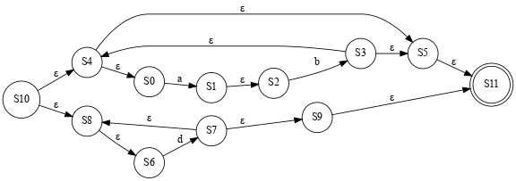

# Help
```
$ python main.py --help
```

# Input Regex Expression
```
$ python main.py --regex 'regex_expression'
```

# Change output graph image and json filename
```
$ python main.py --regex 'regex_expression' --graph filename
```
# Example
```$ python main.py --regex '(ab)*|d+' --graph mygraph```


<p align="center">
  
</p>

# Developers 
<center>
  
| Name                                |              Email               |
| ----------------------------------- | :------------------------------: |
| Ahmad Mahmoud AbdElMen'em           | ahmed.afifi.cufe@gmail.com       |
| Abdulrahman Khalid Hassan           | abdulrahman.elshafei98@gmail.com |

</center>
